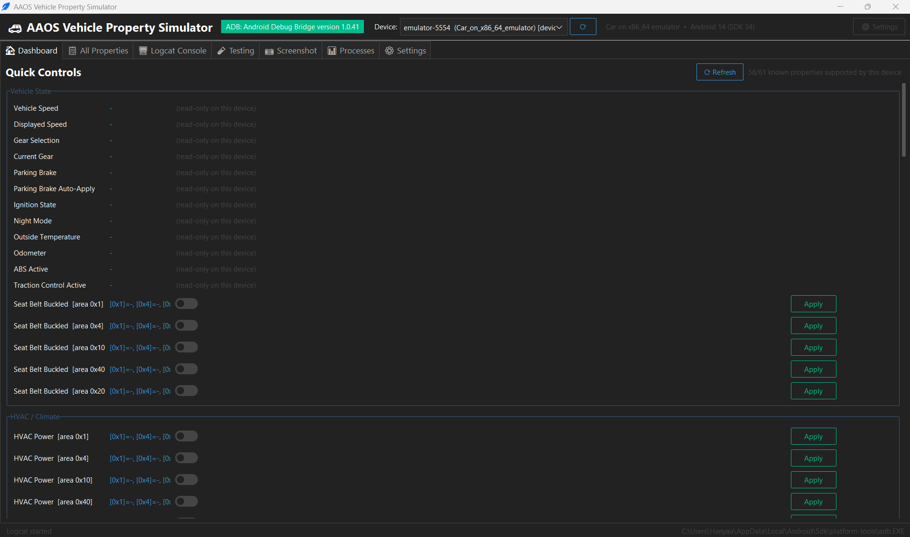
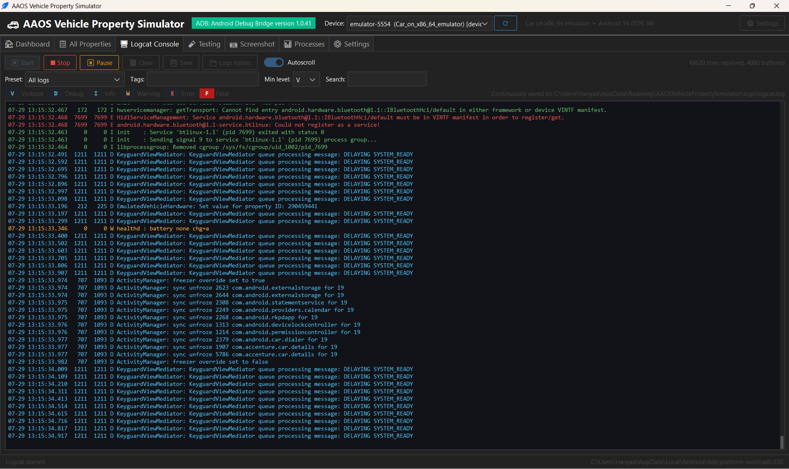
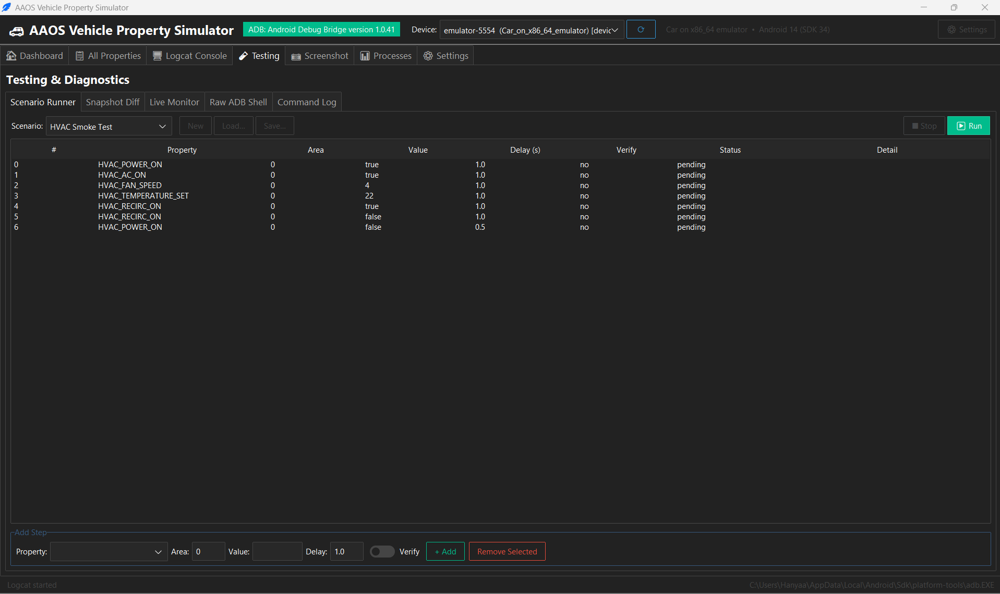
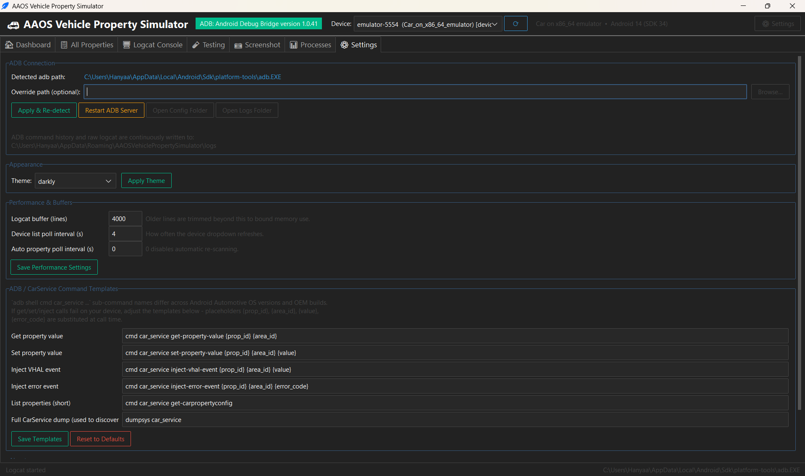

# AAOS Vehicle Property Simulator

A desktop GUI tool for developing and testing **Android Automotive OS (AAOS)**
vehicle properties over **ADB** - get/set/inject property values, browse
every property the connected device supports, watch filtered/colored
`logcat`, and run scripted test scenarios. Built with Python + Tkinter
(via [ttkbootstrap](https://ttkbootstrap.readthedocs.io/)) so it runs the
same way on Windows and Linux.

## Screenshots

<table>
<tr>
<td width="50%">

**Dashboard** — quick controls for the most common properties, greyed
out automatically when the connected device doesn't support them.

</td>
<td width="50%">

**All Properties** — full property browser: search/filter, area &
value-type-aware editor, live ADB command preview, multi-format export.

</td>
</tr>
<tr>
<td width="50%">

**Logcat Console** — filtered, color-coded log streaming with
continuous on-disk logging.

</td>
<td width="50%">

**Testing** — scenario runner, snapshot diff, live property monitor,
raw ADB shell, and the ADB request/response Command Log.

</td>
</tr>
<tr>
<td width="50%">

**Screenshot** — capture the device's display, preview it, save
full-resolution PNGs, or enable a live-refreshing preview.

</td>
<td width="50%">

**Processes** — live process list with RSS/VSZ memory, and a full
`dumpsys meminfo` breakdown for whichever process is selected.

</td>
</tr>
<tr>
<td width="50%">

**Settings** — ADB path override, theme picker, editable command
templates, performance/buffer tuning, and quick links to config/log
folders.

</td>
<td width="50%">

See [docs/](docs/) for the full architecture, functionality, and
internal working-process writeups.
</td>
</tr>
</table>

## Features

- **Device connection bar** - detects `adb`, scans for devices, and gives
  you a dropdown when more than one device/emulator is attached.
- **Dashboard tab** - quick controls for the most common properties
  (vehicle speed, gear, parking brake, ignition, HVAC, doors/windows,
  lights, fuel/EV battery, ...). Controls a device doesn't support are
  greyed out with a "Not supported" badge instead of guessing.
- **All Properties tab** - every property the device reports, with
  search/category/access filters, and a details panel with:
  - an **Area ID dropdown** populated from the areas the property actually
    declares (decoded with their symbolic name where known, e.g.
    `0x1 (ROW_1_LEFT)`);
  - a **value input that adapts to the property's type** - radio buttons
    for `BOOLEAN`, a dropdown of the exact valid values when the device
    reports a `configArray` (e.g. gear positions), and a free-text field
    otherwise;
  - a live **ADB command preview** showing the exact `adb ...` command
    each of Get/Set/Inject Event/Inject Error would run, so nothing here
    is a black box;
  - a **"Fetch Current Values"** action (`dumpsys car_service` only gives
    property *definitions*, not live values - this backfills them via
    `get-property-value`, with a progress bar since it's one call per
    property);
  - full-detail export in **CSV, JSON, XML, HTML, or Excel (.xlsx)**
    (every field the app knows about, including the raw dump and
    configArray, not just the table columns) - format is chosen by the
    file extension you save as.
- **Logcat Console tab** - start/stop streaming, filter presets (Car
  Service, Vehicle HAL, Property Changes, Warnings+, Errors only), custom
  tag/level filters, live search, color-coded severity, clear (device +
  local), save to file, autoscroll/pause - all rendered through a bounded
  buffer so long sessions don't grow memory without limit. Every line
  received is also continuously appended to a rotating log file on disk
  (see Logging below), independent of the in-memory view.
- **Testing tab** - a scenario runner (built-in HVAC/gear/speed/lights
  scenarios plus a custom step editor, save/load as JSON), snapshot
  diffing (capture two property snapshots and diff them), a live property
  monitor, a raw `adb shell` console with history, and a **Command Log**
  panel showing every ADB request/response the app has made, live,
  filterable, and exportable.
- **Screenshot tab** - capture the device's display (`adb exec-out
  screencap`), preview it, save full-resolution PNGs, or enable "Live
  preview" to keep re-capturing at a chosen interval (a slow snapshot
  loop, not true video mirroring).
- **Processes tab** - the device's running processes (`ps -A`) with PID,
  user, RSS/VSZ memory, and name; select a process to see its full
  `dumpsys meminfo <pid>` breakdown (Java/Native heap, PSS/RSS, private
  dirty, ...) with a quick-glance summary line. "Live updates" refreshes
  both the list and whichever process is currently selected, at a chosen
  interval. Exportable in the same 5 formats as Properties.
- **Settings tab** - ADB path override, theme picker, logcat buffer size
  and poll intervals, editable command templates (see below), and quick
  links to the config/logs folders.
- **Loaders and popups** - long operations (property scans, bulk value
  fetches, scenario runs) show a progress indicator instead of freezing
  silently, and key actions (exports, fetch completion, blocked actions)
  confirm with a dialog rather than an easy-to-miss status line.

## Logging

Two kinds of logs are kept, both bounded so "continuous" never means
"unbounded":

- **In-memory, for the GUI** - the Logcat Console's buffer and the
  Testing tab's Command Log both cap how much they retain (configurable
  buffer size for logcat; a fixed cap for the command log) so long
  sessions don't grow memory without limit.
- **On disk, continuously, regardless of the GUI** - every ADB command
  the app runs (`adb_commands.log`) and every logcat line received while
  streaming (`logcat.log`) are appended to rotating log files under the
  app's config directory (Settings → "Open Logs Folder", or Testing →
  Command Log shows the exact path) as they happen - not just when you
  click Save/Export. Rotation keeps disk usage bounded.

## Requirements

- Python 3.9+
- Android `platform-tools` (`adb`) - the app tries to auto-detect it, but
  you can also point it at a specific binary from the Settings tab.
- A dev/test AAOS target: the [Android Automotive emulator](https://developer.android.com/training/cars/testing)
  or a real head unit with USB/network debugging enabled.

## Getting started

**Windows:**
```
run.bat
```

**Linux / macOS:**
```
./run.sh
```

Either script creates a local `.venv`, installs `requirements.txt` into
it, and launches the app. Re-running the script reuses the existing venv.
If your Python doesn't have `tkinter` (some minimal Linux installs don't
ship it by default), the script tells you the right package to install
(e.g. `sudo apt install python3-tk`).

To run directly once a venv is set up:
```
python main.py
```

## A note on command syntax (please read)

Android Automotive OS's `adb shell cmd car_service ...` sub-command names
and `dumpsys car_service` output format have **changed across releases and
OEM builds** - there is no single frozen spec for them. This app is built
defensively around that fact:

- **Property discovery never guesses IDs.** Every property ID shown or
  acted on is read live from your connected device's own
  `dumpsys car_service` output (App → All Properties → Refresh). The
  "known properties" used to build the Dashboard are matched **by name
  only** against what your device actually reports - if a name isn't
  present, its control is simply hidden, never mis-wired to a guessed ID.
- **The dump parser is tolerant, not exact.** It looks for common
  `key: value` / `key=value` patterns and hex property IDs rather than
  assuming one exact layout, and it always keeps the raw text per property
  (visible in the details panel) so nothing is silently lost even if a
  field isn't parsed into a column.
- **Get/Set/Inject command syntax is a template you can edit.** Go to
  **Settings → ADB / CarService Command Templates** and adjust the
  `cmd car_service ...` strings to match your build - placeholders
  `{prop_id}`, `{area_id}`, `{value}`, `{error_code}` are substituted at
  call time. No code changes required.
- **Enum decode labels are best-effort.** `data/vehicle_property_enums.json`
  maps a few common properties (gear, ignition state, turn signal, HVAC
  fan direction, ...) from raw int to a human label for display only. It's
  plain JSON - edit it freely; it never changes what gets sent to the
  device.
- When something doesn't work as expected, the **Testing → Raw ADB Shell**
  panel lets you run any `adb shell` command directly for troubleshooting.

## Documentation

For more depth than this README, see **[docs/](docs/)**:

- [docs/ARCHITECTURE.md](docs/ARCHITECTURE.md) - module layout, core
  objects, the threading model, and a data-flow diagram.
- [docs/FUNCTIONALITY.md](docs/FUNCTIONALITY.md) - a detailed
  walkthrough of every tab.
- [docs/WORKING_PROCESS.md](docs/WORKING_PROCESS.md) - the internals:
  how property discovery actually parses `dumpsys`, why live values
  need a second call, the logcat/logging pipelines, and the defensive
  design decisions behind all of it.

## Project layout

```
main.py                     entry point
app/
  adb_manager.py            adb discovery, device scan, shell exec, logcat streaming, screenshot capture
  car_service.py             dumpsys car_service parsing + get/set/inject commands
  property_registry.py       curated "known" properties for the Dashboard (matched by name)
  device_tools.py             ps / dumpsys meminfo parsing for the Processes tab
  export_utils.py             shared CSV/JSON/XML/HTML/Excel exporter
  command_log.py              in-memory ADB request/response log (Testing -> Command Log)
  persistent_log.py           continuous rotating file logs (adb commands + logcat)
  config.py                   persistent settings (JSON, under the OS user config dir)
  gui/
    main_window.py            top bar (device selector) + tab notebook + status bar
    context.py                 shared app state passed to every tab
    tabs/                      dashboard, properties, logcat, testing, screenshot, processes, settings
  utils/                       background-thread helpers + small filesystem helpers
data/vehicle_property_enums.json   best-effort enum decode table (editable)
tests/                        unit tests for the parsers/managers (no device/adb required)
docs/                         architecture, functionality, and working-process documentation
```

## Running the tests

```
pip install -r requirements-dev.txt
python -m pytest
```

The test suite covers every parser and exporter (`dumpsys` output, the
device list, `ps`/`dumpsys meminfo`, `get-property-value` responses,
CSV/JSON/XML/HTML/Excel export, the area/value decoration helpers) and
the Dashboard's name-based matching logic - all pure functions, so no
adb binary or attached device is required to run them. Several fixtures
are captured verbatim from a real AAOS emulator rather than invented, to
validate against real device output rather than against the regexes'
own assumptions.

## Performance & memory notes

- Logcat is streamed and rendered incrementally (not re-parsed from
  scratch), with both the retained buffer and the on-screen Text widget
  bounded by **Settings → Logcat buffer (lines)** (default 4000).
- The full property dump (`dumpsys car_service`) is only fetched on
  device connect and on manual refresh by default - not on a tight
  timer - since it can be a heavy call on some builds. You can enable
  periodic auto-refresh from Settings if you want it.
- Device polling, property polling, and the logcat reader all guard
  against overlapping calls, so a slow/unresponsive device can't stack up
  background threads or adb processes.
