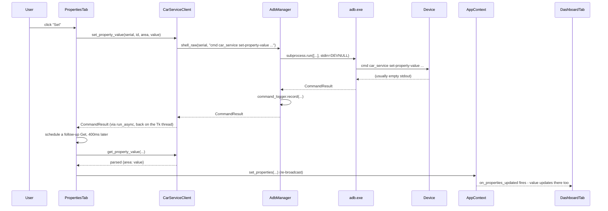

# Architecture

## Layering

The app is split into two layers that never leak into each other:

```
app/
  adb_manager.py        \
  car_service.py          |
  property_registry.py    |
  config.py                |  Backend - no tkinter imports anywhere,
  command_log.py            |  unit-testable headlessly (see tests/),
  persistent_log.py         |  safe to import without a display attached
  export_utils.py           |
  device_tools.py           |
  apk_tools.py               |
  version.py               /

  gui/
    main_window.py        \
    context.py               |  UI layer - owns every Tk widget, talks
    theme.py                  |  to the backend only through
    widgets.py                 |  AppContext and the backend modules'
    tabs/*.py                /  public methods
```

Nothing under `app/` imports anything under `app/gui/` - the backend
never depends on the GUI. That's what makes the parsers and managers
testable with plain `pytest` and no Tk/display required; every file in
`tests/` imports only from `app/` directly.

## Core objects

- **`AdbManager`** (`app/adb_manager.py`) - the only place that shells
  out to `adb`. Every one-shot command funnels through
  `AdbManager._run()`, which is the single choke point for:
  - request/response logging (`command_logger.record(...)` is called
    here, so every command anywhere in the app - device scans, get/set,
    dumpsys, screenshots - is logged automatically without
    instrumenting each call site);
  - defensive process spawning (`stdin=subprocess.DEVNULL`,
    `CREATE_NO_WINDOW` on Windows, explicit timeouts).

  `LogcatStream` is the one exception to "one-shot": it's a
  long-running `Popen` for `adb logcat`, read on a background thread
  into a bounded `queue.Queue` (see
  [WORKING_PROCESS.md](WORKING_PROCESS.md#logcat-streaming-pipeline)).

- **`CarServiceClient`** (`app/car_service.py`) - builds
  `cmd car_service ...` commands from the user-editable templates in
  `config.py`, and owns two parsers:
  - `parse_dumpsys_output` - turns a `dumpsys car_service` dump into a
    list of `VehicleProperty` dataclasses (property *definitions*: id,
    name, access, change mode, area type, value type, min/max,
    configArray, declared areas);
  - `parse_hal_prop_values` - turns a `get-property-value` response
    (`HalPropValue{...}` text) into `{area_id: value}`.

  It always returns dataclasses to the GUI layer, never raw text to
  parse twice.

- **`app/apk_tools.py`** - pure-function helpers behind the APK Install
  tab: `PUSH_TARGET_PRESETS` (the standard system partition install
  directories), `suggest_target_path`, `parse_package_list` (`pm list
  packages` output), `parse_overlay_list` (`cmd overlay list` output,
  tolerant of the "target package header + indented `[x]`/`[ ]` lines"
  layout), and `build_install_flags`. None of it shells out to `adb`
  itself - `AdbManager` and `PushWorkflowRunner` do that and hand this
  module raw text to parse, keeping the parsing logic independently
  testable the same way `car_service.py`'s parsers are.

- **`app/version.py`** - derives the version string shown in the About
  tab. `BASE_VERSION` is the one manually-maintained value (in
  `app/__init__.py`); everything else - commit count, short hash, dirty
  flag - is read live from git via `git rev-list --count HEAD`,
  `git rev-parse --short HEAD`, and `git status --porcelain`, cached
  with `@lru_cache` so it only shells out once per run. See
  [WORKING_PROCESS.md](WORKING_PROCESS.md#git-derived-versioning) for
  why it's computed instead of hand-bumped.

- **`AppContext`** (`app/gui/context.py`) - the one object every tab
  receives in its constructor. It holds the current device, the current
  property list, and a small pub/sub mechanism:
  - `on_device_changed(callback)` / `set_current_device(device)`
  - `on_properties_updated(callback)` / `set_properties(properties)`
  - `notify_status(message, level)` - status bar
  - `begin_busy(message)` / `end_busy()` - status bar progress indicator

  Tabs never hold direct references to each other. The Dashboard picks
  up a value changed in the Properties tab purely by having subscribed
  to `ctx.on_properties_updated` - the Properties tab has no idea the
  Dashboard exists.

- **`MainWindow`** (`app/gui/main_window.py`) - builds the top bar
  (device selector), the tab notebook, and the status bar; owns the
  device-list `Poller` and the optional property-list `Poller`.

## Threading model

Tkinter is single-threaded: only the main thread may touch a widget.
Every blocking call (subprocess, meaningful file I/O) runs on a
background thread via one of two helpers in `app/utils/workers.py`:

- **`run_async(widget, func, on_done, on_error)`** - fire-and-forget:
  runs `func` on a daemon thread, then marshals the result back to the
  Tk thread via `widget.after(0, ...)`. This is what every one-off
  action in the app uses (Get, Set, Capture, manual Refresh, ...).
  `_safe_after` (used internally) guards against the window having been
  destroyed while a background thread was still in flight - a normal
  shutdown race, not an error worth surfacing.

- **`Poller`** - repeats `run_async` on a timer, but **skips a tick if
  the previous one hasn't finished** rather than queuing it up. This is
  the mechanism behind every "Live" / auto-refresh toggle in the app
  (device list polling, Screenshot's Live preview, Processes' Live
  updates, Testing → Live Monitor) - it's what guarantees a
  slow/unresponsive device can never stack up overlapping background
  threads or `adb` processes.

## Sequential background workflows

Two features need to run an ordered list of steps in the background,
report each step's status as it happens, and be stoppable mid-run:
Testing's Scenario Runner (`testing_tab.py`) and APK Install's
`PushWorkflowRunner` (`apk_install_tab.py`). Both follow the same
shape rather than sharing a base class, since the step types and error
handling differ enough that a shared abstraction would mostly be
indirection:

- `build_steps()` turns the current UI state (checked options, the
  entry list) into an ordered list of `(label, step_fn)` pairs.
- `run()` executes them one at a time on a background thread, putting
  `(status, index, label, detail)` tuples onto a `queue.Queue` after
  each step - `"running"` immediately before, then `"pass"`/`"fail"`.
  The GUI thread drains the queue on a `root.after` poll loop and
  updates a `Treeview` row per step, so the whole run is visible
  progressing live rather than appearing as one opaque blocking call.
- A `stop_on_failure` flag (and a manual Stop button, checked between
  steps) lets the run halt early instead of ploughing through
  irrelevant steps after e.g. `adb root` fails.

See [WORKING_PROCESS.md](WORKING_PROCESS.md#push-and-system-workflow-design)
for why the push workflow's steps are ordered the way they are.

## Data flow: a Set action, end to end



The follow-up Get exists because `set-property-value` doesn't echo the
new value back, and `dumpsys car_service` never carries live values at
all - without it, a successful Set looks exactly like nothing happened.
See [WORKING_PROCESS.md](WORKING_PROCESS.md#definitions-vs-live-values)
for why.

## Persistence

Two separate stores, both **outside** the project directory, so a fresh
git checkout never carries any user state:

- **`app/config.py`** - `settings.json` under the OS user config dir
  (`%APPDATA%\AAOSVehiclePropertySimulator` on Windows,
  `~/.config/AAOSVehiclePropertySimulator` on Linux/macOS). Theme, ADB
  path override, buffer sizes, poll intervals, and the editable command
  templates.
- **`app/persistent_log.py`** - `logs/adb_commands.log` and
  `logs/logcat.log` under the same config dir, via `RotatingFileHandler`
  (5&nbsp;MB &times; 5 backups each). Written continuously regardless of
  what's currently on screen - see
  [WORKING_PROCESS.md](WORKING_PROCESS.md#logging-pipeline).

## GUI tab inventory

| Tab | File | Sub-tabs |
|---|---|---|
| Dashboard | `app/gui/tabs/dashboard_tab.py` | - |
| All Properties | `app/gui/tabs/properties_tab.py` | - |
| Logcat Console | `app/gui/tabs/logcat_tab.py` | - |
| Testing | `app/gui/tabs/testing_tab.py` | Scenario Runner, Snapshot Diff, Live Monitor, Raw ADB Shell, Command Log |
| Screenshot | `app/gui/tabs/screenshot_tab.py` | - |
| Processes | `app/gui/tabs/processes_tab.py` | - |
| APK Install | `app/gui/tabs/apk_install_tab.py` | Quick Install, Push & System Workflow, Packages & Overlays |
| Settings | `app/gui/tabs/settings_tab.py` | - |
| About | `app/gui/tabs/about_tab.py` | - |

## Testing strategy

`tests/` covers the pure-function backend only (parsers, exporters, the
name-based Dashboard matcher, the area/value decoration helpers) -
nothing that requires a display or a real device. Several fixtures are
**captured verbatim from a real AAOS emulator** (see the `REAL_*`
constants in `tests/test_car_service.py` and
`tests/test_device_tools.py`) rather than hand-invented sample text,
specifically because the whole parsing strategy exists to survive real
device format quirks - testing against invented text would validate the
regexes against themselves, not against reality.

GUI behavior itself is verified manually/interactively during
development against a live emulator (screenshots, real command
execution, real timing) rather than via an automated GUI test suite -
there's no headless Tk test harness in this project.
